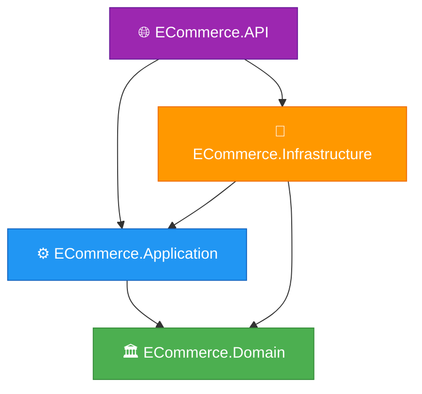
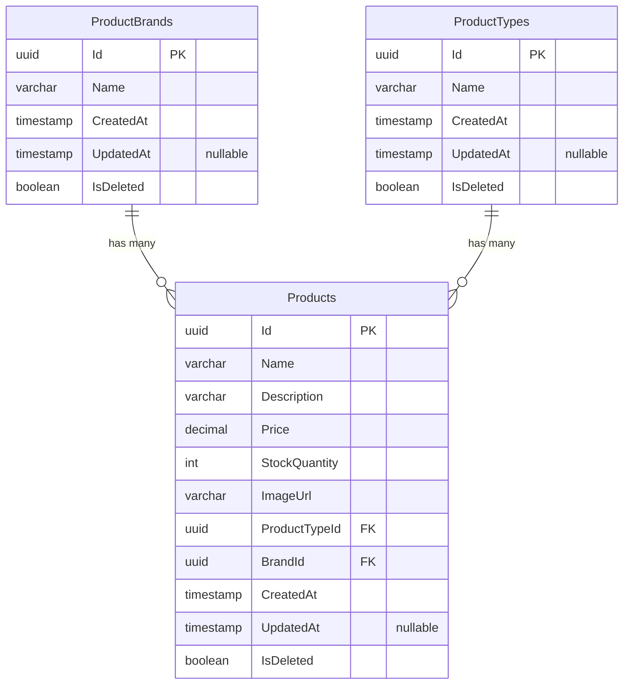
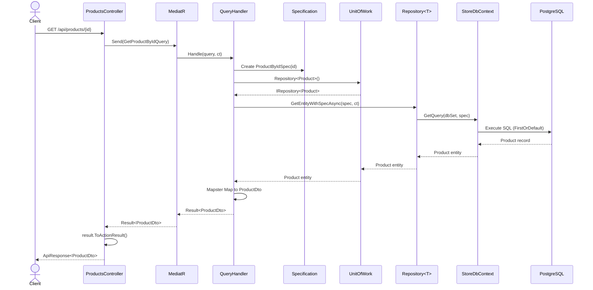

<div align="center">

# 🛒 ECommerce Clean Architecture API

### A modern, production-grade RESTful API built with ASP.NET Core 10 and Clean Architecture

[](https://dotnet.microsoft.com/)
[](https://learn.microsoft.com/en-us/ef/core/)
[](https://www.postgresql.org/)
[](https://github.com/jbogard/MediatR)
[](https://github.com/MapsterMapper/Mapster)
[](https://swagger.io/)
[](LICENSE)

**CQRS** · **Specification Pattern** · **Result Pattern** · **Soft Delete** · **Auditable Entities** · **Seeder Pattern**

---

</div>

## 📑 Table of Contents

- [📖 About The Project](#-about-the-project)
- [🏗️ Architecture](#️-architecture)
- [🗄️ Database Schema](#️-database-schema)
- [🔄 Request Flow](#-request-flow)
- [📐 Clean Architecture Layers](#-clean-architecture-layers)
- [🛠️ Tech Stack](#️-tech-stack)
- [📁 Project Structure](#-project-structure)
- [🚀 Getting Started](#-getting-started)
- [📡 API Endpoints](#-api-endpoints)
- [🎨 Design Patterns](#-design-patterns)
- [⚙️ Configuration](#️-configuration)
- [📋 Changelog](#-changelog)
- [🤝 Contributing](#-contributing)
- [📄 License](#-license)

---

## 📖 About The Project

ECommerce Clean Architecture API is a RESTful web API for an e-commerce platform built following **Clean Architecture** principles with strict layer separation. The project demonstrates professional-grade patterns including CQRS with MediatR, Generic Repository with Unit of Work, the Specification Pattern for composable queries, and a Result Pattern for consistent error handling.

### ✨ Key Features

| Feature | Status | Description |
|---------|--------|-------------|
| 🏛️ Clean Architecture | ✅ Implemented | 4-layer architecture with strict dependency rules |
| 📦 CQRS + MediatR | ✅ Implemented | Queries separated from commands via MediatR handlers |
| 🔍 Specification Pattern | ✅ Implemented | Composable, reusable query specifications with includes, ordering, and paging |
| 🗃️ Generic Repository | ✅ Implemented | Type-safe repository with Unit of Work for transactional consistency |
| ✅ Result Pattern | ✅ Implemented | `Result<T>` and `Error` types for explicit success/failure flow |
| 🌐 API Response Wrapper | ✅ Implemented | Consistent `ApiResponse<T>` envelope for all endpoints |
| 🗑️ Soft Delete | ✅ Implemented | Global query filter via `IsDeleted` flag — data is never physically removed |
| 📝 Auditable Entities | ✅ Implemented | `CreatedAt` and `UpdatedAt` auto-stamped via EF Core interceptor |
| 🌱 Seeder Pattern | ✅ Implemented | `SeederCoordinator` with ordered, transactional data seeding |
| 🖼️ Cloudinary Images | ✅ Implemented | Product images hosted on Cloudinary CDN |
| 🔐 User Secrets | ✅ Implemented | Sensitive config stored securely outside source control |
| 📦 Central Package Mgmt | ✅ Implemented | All NuGet versions managed in `Directory.Packages.props` |
| 🗺️ Mapster Mapping | ✅ Implemented | Object mapping via `IRegister` configurations |
| 📜 Swagger / OpenAPI | ✅ Implemented | Interactive API documentation in development |
| ✏️ Create / Update / Delete | 🚧 Planned | Command handlers not yet implemented |

---

## 🏗️ Architecture

The project follows **Clean Architecture** with strict inward dependency flow. Outer layers depend on inner layers — never the reverse.



### 📦 Project Reference Chain

```
ECommerce.API
├── References → ECommerce.Application
└── References → ECommerce.Infrastructure
    └── References → ECommerce.Application
        └── References → ECommerce.Domain (innermost — zero dependencies)
```

---

## 🗄️ Database Schema

Entity Relationship Diagram derived from EF Core entity configurations and domain entities.



> **Notes:**
> - All entities inherit from `BaseEntity` (`Id`, `CreatedAt`, `UpdatedAt`, `IsDeleted`)
> - Soft delete is enforced via a global `HasQueryFilter(x => !x.IsDeleted)`
> - Foreign keys use `DeleteBehavior.Restrict` to prevent cascading deletes
> - `IsDeleted` column defaults to `false` at the database level

---

## 🔄 Request Flow

Complete request lifecycle from HTTP to database and back, based on the actual implementation.



---

## 📐 Clean Architecture Layers

### 🏛️ Domain Layer (`ECommerce.Domain`)

The **innermost** layer — zero external dependencies. Contains:

| Component | Description |
|-----------|-------------|
| `BaseEntity` | Abstract base with `Id`, `CreatedAt`, `UpdatedAt`, `IsDeleted` |
| `Product` | Rich entity with factory method `Create()`, domain methods `Update()`, `AddStock()`, `RemoveStock()` |
| `ProductBrand` | Lookup entity with `Create()` and `Update()` methods |
| `ProductType` | Lookup entity with `Create()` and `Update()` methods |
| `IRepository<T>` | Generic repository contract |
| `ISpecification<T>` | Specification pattern contract (Criteria, Includes, OrderBy, Paging) |
| `IUnitOfWork` | Unit of Work contract with `SaveChangesAsync` |

### ⚙️ Application Layer (`ECommerce.Application`)

The **use-case orchestration** layer. Depends only on Domain. Contains:

| Component | Description |
|-----------|-------------|
| `Result<T>` / `Error` | Result pattern types for error handling without exceptions |
| `BaseSpecification<T>` | Abstract specification base class implementing `ISpecification<T>` |
| `GetProductsQuery` | MediatR query to retrieve all products |
| `GetProductByIdQuery` | MediatR query to retrieve a single product by ID |
| `GetAllBrandsQuery` | MediatR query to retrieve all brands |
| `GetAllTypesQuery` | MediatR query to retrieve all product types |
| `GetProductsQueryHandler` | Handler for products list (uses `ProductsWithBrandAndTypeSpec`) |
| `GetProductByIdQueryHandler` | Handler for single product (uses `ProductByIdSpec`) |
| `GetAllBrandsQueryHandler` | Handler for brands list |
| `GetAllTypesQueryHandler` | Handler for types list |
| `ProductDto` / `BrandDto` / `TypeDto` | Immutable record DTOs |
| `ProductMappingConfig` | Mapster `IRegister` configuration |

### 🔧 Infrastructure Layer (`ECommerce.Infrastructure`)

The **external concerns** layer. Implements Application interfaces. Contains:

| Component | Description |
|-----------|-------------|
| `StoreDbContext` | EF Core DbContext with `Products`, `ProductBrands`, `ProductTypes` DbSets |
| `Repository<T>` | Generic repository implementation using `StoreDbContext` |
| `UnitOfWork` | Unit of Work with `ConcurrentDictionary` repository cache |
| `SpecificationEvaluator<T>` | Translates `ISpecification<T>` into EF Core `IQueryable<T>` |
| `AuditableEntityInterceptor` | EF `SaveChangesInterceptor` — stamps `CreatedAt`, `UpdatedAt`, handles soft delete |
| `BaseEntityConfiguration<T>` | Base EF config — `IsDeleted` default + global query filter |
| `ProductConfiguration` | Product EF config — max lengths, decimal precision, FK relationships |
| `ProductBrandConfiguration` | Brand EF config |
| `ProductTypeConfiguration` | Type EF config |
| `SeederCoordinator` | Orchestrates seeders in order within a transaction |
| `BrandSeeder` / `TypeSeeder` / `ProductSeeder` | Seed data with Cloudinary image URLs |

### 🌐 API Layer (`ECommerce.API`)

The **presentation** layer. Entry point. Contains:

| Component | Description |
|-----------|-------------|
| `Program.cs` | App startup — DI registration, seeding, middleware pipeline |
| `BaseController` | Abstract controller base with MediatR resolution |
| `ProductsController` | Thin controller — delegates to MediatR, returns `ApiResponse<T>` |
| `ApiResponse<T>` | Unified response wrapper (`Success`, `Data`, `Error`) |
| `ApiError` | Error wrapper with HTTP status code mapping |
| `ValidationError` | Validation detail object |
| `ResultExtensions` | `ToActionResult<T>()` extension bridging `Result<T>` → `ActionResult` |

---

## 🛠️ Tech Stack

All versions sourced from [`Directory.Packages.props`](Directory.Packages.props) and `.csproj` files.

| Technology | Version | Purpose |
|------------|---------|---------|
| .NET | 10.0 | Runtime & SDK |
| ASP.NET Core | 10.0 | Web API framework |
| Entity Framework Core | 10.0.9 | ORM & migrations |
| Npgsql (PostgreSQL) | 10.0.2 | PostgreSQL EF Core provider |
| MediatR | 14.1.0 | CQRS mediator / in-process messaging |
| Mapster | 10.0.9 | Object-to-object mapping |
| Mapster.DependencyInjection | 10.0.9 | Mapster DI integration |
| Swashbuckle.AspNetCore | 10.2.3 | Swagger / OpenAPI documentation |
| Microsoft.AspNetCore.OpenApi | 10.0.9 | OpenAPI metadata |
| Microsoft.Extensions.DI.Abstractions | 10.0.9 | DI abstractions for class libraries |
| Microsoft.Extensions.Options | 10.0.9 | Options pattern support |

---

## 📁 Project Structure

```
ECommerce/
├── 📄 ECommerce.slnx                          # Solution file
├── 📄 Directory.Packages.props                 # Central Package Management
├── 📄 .gitignore
│
└── Src/
    ├── 🏛️ ECommerce.Domain/                    # Innermost layer — no dependencies
    │   ├── Entities/
    │   │   ├── BaseEntity.cs                   # Abstract base (Id, CreatedAt, UpdatedAt, IsDeleted)
    │   │   ├── Product.cs                      # Rich entity with Create(), Update(), AddStock(), RemoveStock()
    │   │   ├── ProductBrand.cs                 # Lookup entity with Create(), Update()
    │   │   └── ProductType.cs                  # Lookup entity with Create(), Update()
    │   ├── Interfaces/
    │   │   ├── IRepository.cs                  # Generic repository contract
    │   │   ├── ISpecification.cs               # Specification pattern contract
    │   │   └── IUnitOfWork.cs                  # Unit of Work contract
    │   └── ECommerce.Domain.csproj
    │
    ├── ⚙️ ECommerce.Application/               # Use cases — depends on Domain
    │   ├── Common/
    │   │   ├── Results/
    │   │   │   ├── Result.cs                   # Result<T> with Success/Failure factories
    │   │   │   └── Error.cs                    # Error type (NotFound, Validation, Conflict, etc.)
    │   │   └── Specifications/
    │   │       └── BaseSpecification.cs        # Abstract base for all specifications
    │   ├── Features/
    │   │   └── Products/
    │   │       ├── Commands/                   # 🚧 (Empty — planned for create/update/delete)
    │   │       ├── Queries/
    │   │       │   ├── GetProductsQuery.cs
    │   │       │   ├── GetProductByIdQuery.cs
    │   │       │   ├── GetAllBrandsQuery.cs
    │   │       │   └── GetAllTypesHandler.cs   # Contains GetAllTypesQuery record
    │   │       ├── Handlers/
    │   │       │   ├── GetProductsQueryHandler.cs
    │   │       │   ├── GetProductByIdQueryHandler.cs
    │   │       │   ├── GetAllBrandsHandler.cs
    │   │       │   └── GetAllTypesHandler.cs
    │   │       ├── Dtos/
    │   │       │   ├── ProductDto.cs            # (Id, Name, Description, Price, StockQuantity, ImageUrl, Brand, Type)
    │   │       │   ├── BrandDto.cs              # (Id, Name)
    │   │       │   └── TypeDto.cs               # (Id, Name)
    │   │       ├── Mappings/
    │   │       │   └── ProductMappingConfig.cs  # Mapster IRegister — maps Brand.Name, ProductType.Name
    │   │       └── Specifications/
    │   │           ├── ProductByIdSpec.cs        # Criteria: Id match + Includes: Brand, Type
    │   │           └── ProductsWithBrandAndTypeSpec.cs  # Includes: Brand, Type + OrderBy: Name
    │   ├── DependencyInjection.cs              # AddApplication() — MediatR + Mapster registration
    │   └── ECommerce.Application.csproj
    │
    ├── 🔧 ECommerce.Infrastructure/            # External concerns — depends on Application
    │   ├── Persistence/
    │   │   ├── DbContexts/
    │   │   │   └── StoreDbContext.cs            # DbContext with Products, ProductBrands, ProductTypes
    │   │   ├── Configurations/
    │   │   │   ├── BaseEntityConfiguration.cs   # IsDeleted default + QueryFilter
    │   │   │   ├── ProductConfiguration.cs      # MaxLength, decimal precision, FK relationships
    │   │   │   ├── ProductBrandConfiguration.cs
    │   │   │   └── ProductTypeConfiguratio.cs   # (filename typo in source)
    │   │   ├── Repositories/
    │   │   │   └── Repository.cs               # Generic Repository<T> implementation
    │   │   ├── UnitOfWork/
    │   │   │   └── UnitOfWork.cs               # UoW with ConcurrentDictionary repo cache
    │   │   ├── Specifications/
    │   │   │   └── SpecificationEvaluator.cs   # Translates ISpecification → IQueryable
    │   │   ├── Interceptors/
    │   │   │   └── AuditableEntityInterceptor.cs  # Stamps CreatedAt, UpdatedAt, handles soft delete
    │   │   └── Seeders/
    │   │       ├── ISeeder.cs                  # Seeder contract
    │   │       ├── SeederCoordinator.cs         # Ordered transactional seeding
    │   │       ├── BrandSeeder.cs              # Seeds 8 brands (Nike, Zara, H&M, etc.)
    │   │       ├── TypeSeeder.cs               # Seeds 6 types (T-Shirts, Jackets, Pants, etc.)
    │   │       └── ProductSeeder.cs            # Seeds 13 products with Cloudinary images
    │   ├── Migrations/
    │   │   ├── 20260627164247_InitialCreate.cs
    │   │   ├── 20260627164247_InitialCreate.Designer.cs
    │   │   └── StoreDbContextModelSnapshot.cs
    │   ├── DependencyInjection.cs              # AddInfrastructure() — DbContext, UoW, Seeders
    │   └── ECommerce.Infrastructure.csproj
    │
    └── 🌐 ECommerce.API/                       # Presentation layer — entry point
        ├── Controllers/
        │   ├── BaseController.cs               # Abstract base with IMediator
        │   └── ProductsController.cs           # GET products, GET by id, GET brands, GET types
        ├── Common/
        │   └── Responses/
        │       ├── ApiResponse.cs              # Unified response wrapper
        │       ├── ApiError.cs                 # Error with HTTP status code mapping
        │       └── ValidationError.cs          # Validation detail object
        ├── Extensions/
        │   └── ResultExtensions.cs             # ToActionResult<T>() bridge
        ├── Properties/
        │   └── launchSettings.json             # HTTP: 5047, HTTPS: 7238
        ├── Program.cs                          # Startup — DI, seeding, middleware
        ├── DependencyInjection.cs              # AddApi() — Controllers, Swagger
        ├── appsettings.json                    # Base URL config
        ├── appsettings.Development.json        # Dev logging config
        └── ECommerce.API.csproj                # UserSecretsId configured
```

---

## 🚀 Getting Started

### 📋 Prerequisites

| Requirement | Version |
|-------------|---------|
| [.NET SDK](https://dotnet.microsoft.com/download) | 10.0 or later |
| [PostgreSQL](https://www.postgresql.org/download/) | 14+ recommended |
| [Git](https://git-scm.com/) | Latest |

### 📥 Installation

```bash
# 1. Clone the repository
git clone https://github.com/your-username/ECommerce.git
cd ECommerce

# 2. Restore dependencies
dotnet restore

# 3. Set up User Secrets (connection string)
cd Src/ECommerce.API
dotnet user-secrets set "ConnectionStrings:DefaultConnection" "Host=localhost;Port=5432;Database=ECommerceDb;Username=postgres;Password=YOUR_PASSWORD"

# 4. Apply EF Core migrations
dotnet ef database update --project ../ECommerce.Infrastructure --startup-project .

# 5. Run the application
dotnet run
```

### 🌐 Access the API

| Environment | URL |
|-------------|-----|
| HTTP | `http://localhost:5047` |
| HTTPS | `https://localhost:7238` |
| Swagger UI | `https://localhost:7238/swagger` |

> 💡 **Tip:** On first startup, the `SeederCoordinator` automatically seeds **8 brands**, **6 product types**, and **13 products** with Cloudinary-hosted images.

---

## 📡 API Endpoints

All endpoints derived from [`ProductsController.cs`](Src/ECommerce.API/Controllers/ProductsController.cs).

| Method | Endpoint | Description | Response Type |
|--------|----------|-------------|---------------|
| `GET` | `/api/products` | Get all products with Brand and Type included | `ApiResponse<IReadOnlyList<ProductDto>>` |
| `GET` | `/api/products/{id:Guid}` | Get a single product by ID | `ApiResponse<ProductDto>` |
| `GET` | `/api/products/brands` | Get all product brands | `ApiResponse<IReadOnlyList<BrandDto>>` |
| `GET` | `/api/products/types` | Get all product types | `ApiResponse<IReadOnlyList<TypeDto>>` |

### 📦 Response Format

All responses are wrapped in a consistent `ApiResponse<T>` envelope:

**✅ Success Response (200 OK)**

```json
{
  "success": true,
  "data": {
    "id": "3fa85f64-5717-4562-b3fc-2c963f66afa6",
    "name": "Casual Sneakers",
    "description": "Lightweight and comfortable casual sneakers",
    "price": 49.99,
    "stockQuantity": 100,
    "imageUrl": "https://res.cloudinary.com/...",
    "brand": "Nike",
    "type": "Shoes"
  },
  "error": null
}
```

**❌ Error Response (404 Not Found)**

```json
{
  "success": false,
  "data": null,
  "error": {
    "code": "Product.NotFound",
    "message": "Product with id '...' was not found",
    "statusCode": 404,
    "details": null
  }
}
```

### 🗺️ Error Code → HTTP Status Mapping

| Error Code Pattern | HTTP Status |
|-------------------|-------------|
| `Auth.Unauthorized` | 401 |
| `Auth.Forbidden` | 403 |
| `Validation.*` | 400 |
| `*.NotFound` | 404 |
| `*.AlreadyExists` | 409 |
| `Server.*` | 500 |
| Default | 400 |

---

## 🎨 Design Patterns

All patterns listed below are **actually implemented** in the codebase.

### 🏛️ Clean Architecture

Four-layer architecture with strict inward dependency flow enforced via project references.

### 📬 CQRS (Command Query Responsibility Segregation)

Queries and commands are separated into distinct MediatR `IRequest<T>` types with dedicated handlers.

```csharp
// Query definition
public record GetProductByIdQuery(Guid Id) : IRequest<Result<ProductDto>>;

// Handler
public class GetProductByIdQueryHandler : IRequestHandler<GetProductByIdQuery, Result<ProductDto>>
{
    public async Task<Result<ProductDto>> Handle(GetProductByIdQuery request, CancellationToken ct) { ... }
}
```

### 🔍 Specification Pattern

Composable query specifications with criteria, includes, ordering, and pagination.

```csharp
public class ProductByIdSpec : BaseSpecification<Product>
{
    public ProductByIdSpec(Guid id) : base(p => p.Id == id)
    {
        AddInclude(p => p.Brand);
        AddInclude(p => p.ProductType);
    }
}
```

### 🗃️ Generic Repository + Unit of Work

Type-safe `IRepository<T>` backed by `UnitOfWork` with thread-safe repository caching.

```csharp
var product = await _unitOfWork
    .Repository<Product>()
    .GetEntityWithSpecAsync(spec, cancellationToken);
```

### ✅ Result Pattern

Explicit success/failure handling without exceptions in the application layer.

```csharp
if (product is null)
    return Result<ProductDto>.Failure(Error.NotFound("Product", request.Id));

return Result<ProductDto>.Success(mapper.Map<ProductDto>(product));
```

### 🏭 Factory Method Pattern

Entities use static `Create()` methods with guard clauses — constructors are private.

```csharp
public static Product Create(string name, string description, decimal price, ...)
{
    ArgumentException.ThrowIfNullOrWhiteSpace(name);
    if (price <= 0) throw new ArgumentException("Price must be greater than zero.");
    return new Product { Name = name, ... };
}
```

### 🗑️ Soft Delete via EF Core Interceptor

The `AuditableEntityInterceptor` intercepts `SaveChangesAsync` and converts `Deleted` state → `Modified` with `IsDeleted = true`. A global `HasQueryFilter` transparently excludes soft-deleted records from all queries.

### 🌱 Seeder Pattern

`SeederCoordinator` orchestrates multiple `ISeeder` implementations in dependency order, wrapped in a database transaction with rollback on failure.

### 📦 Central Package Management (CPM)

All NuGet package versions are centralized in [`Directory.Packages.props`](Directory.Packages.props) — individual `.csproj` files reference packages without specifying versions.

---

## ⚙️ Configuration

### 🔐 User Secrets

Sensitive configuration is stored via .NET User Secrets (not in source control).

```bash
# Required — PostgreSQL connection string
dotnet user-secrets set "ConnectionStrings:DefaultConnection" \
  "Host=localhost;Port=5432;Database=ECommerceDb;Username=postgres;Password=YOUR_PASSWORD"
```

> **User Secrets ID:** `0b41c5fc-3ad1-421a-9935-09b48e943338`  
> Configured in [`ECommerce.API.csproj`](Src/ECommerce.API/ECommerce.API.csproj)

### 📄 appsettings.json

```json
{
  "Logging": {
    "LogLevel": {
      "Default": "Information",
      "Microsoft.AspNetCore": "Warning"
    }
  },
  "AllowedHosts": "*",
  "UrlSettings": {
    "BaseUrl": "https://localhost:7238"
  }
}
```

### 🔑 Configuration Keys Reference

| Key | Location | Description |
|-----|----------|-------------|
| `ConnectionStrings:DefaultConnection` | User Secrets | PostgreSQL connection string |
| `UrlSettings:BaseUrl` | appsettings.json | API base URL |
| `Logging:LogLevel:Default` | appsettings.json | Default log level |
| `ASPNETCORE_ENVIRONMENT` | launchSettings.json | Environment (Development) |

---

## 📋 Changelog

### v0.1.0 - Initial Setup
- Clean Architecture + EF Core + PostgreSQL

### v0.2.0 - Products Module
- Get All Products + Get Product By Id

### v0.3.0 - Seeding
- Real clothing products with Cloudinary images

---

<div align="center">

**Built with ❤️ using Clean Architecture, CQRS, and .NET 10**

⭐ Star this repo if you find it useful!

</div>
